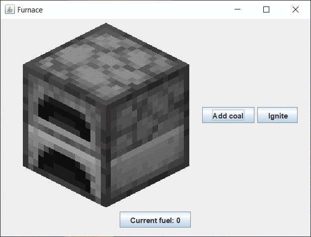

# FurnaceSimulator
A simple app made to learn Swing and Java

Features buttons to add fuel and to ignite the furnace
Current fuel represents amount of seconds it will take before the furnace goes out

